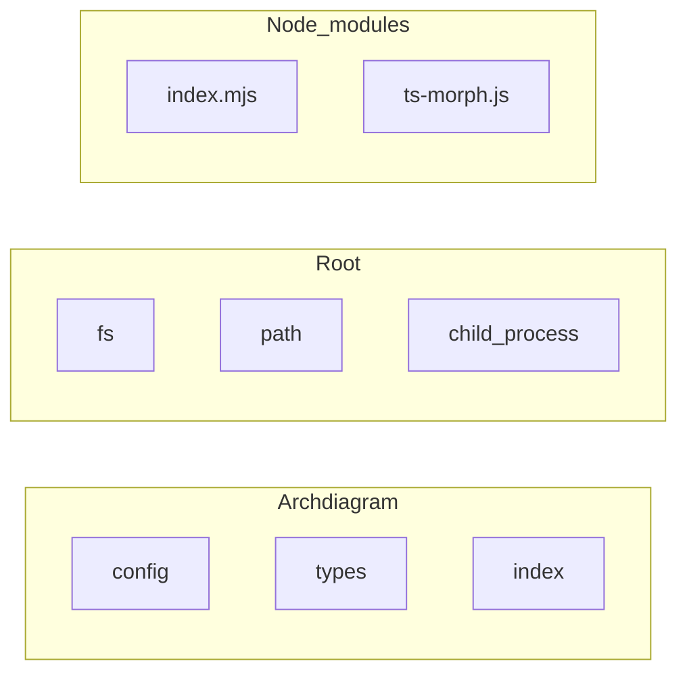

# Architecture: System Overview

```mermaid
graph LR
  subgraph archdiagram["Archdiagram"]
    archdiagram_config["config"]
    archdiagram_types["types"]
    archdiagram_index["index"]
  end
  subgraph root["Root"]
    fs["fs"]
    path["path"]
    child_process["child_process"]
  end
  subgraph node_modules["Node_modules"]
    node_modules_dependency_cruiser_src_main_index_mjs["index.mjs"]
    node_modules_dependency_cruiser_src_main_index_mjs["index.mjs"]
    node_modules_ts_morph_dist_ts_morph_js["ts-morph.js"]
  end
```
