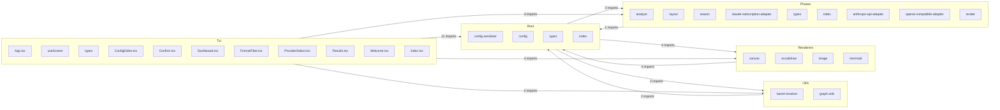

# Architecture: System Overview

```mermaid
graph LR
  subgraph root["Root"]
    config_serializer["config-serializer"]
    config["config"]
    types["types"]
    index["index"]
  end
  subgraph phases["Phases"]
    phases_analyze["analyze"]
    phases_layout["layout"]
    phases_reason["reason"]
    phases_llm_claude_subscription_adapter["claude-subscription-adapter"]
    phases_llm_types["types"]
    phases_llm_index["index"]
    phases_llm_anthropic_api_adapter["anthropic-api-adapter"]
    phases_llm_openai_compatible_adapter["openai-compatible-adapter"]
    phases_render["render"]
  end
  subgraph renderers["Renderers"]
    renderers_canvas["canvas"]
    renderers_excalidraw["excalidraw"]
    renderers_image["image"]
    renderers_mermaid["mermaid"]
  end
  subgraph utils["Utils"]
    utils_barrel_resolver["barrel-resolver"]
    utils_graph_utils["graph-utils"]
  end
  subgraph tui["Tui"]
    tui_app_tsx["App.tsx"]
    tui_hooks_usescreen["useScreen"]
    tui_types["types"]
    tui_screens_configeditor_tsx["ConfigEditor.tsx"]
    tui_screens_confirm_tsx["Confirm.tsx"]
    tui_screens_dashboard_tsx["Dashboard.tsx"]
    tui_screens_formatfilter_tsx["FormatFilter.tsx"]
    tui_screens_providerselect_tsx["ProviderSelect.tsx"]
    tui_screens_results_tsx["Results.tsx"]
    tui_screens_welcome_tsx["Welcome.tsx"]
    tui_index_tsx["index.tsx"]
  end
  root -->|"3 imports"| phases
  root -->|"4 imports"| renderers
  root -->|"2 imports"| utils
  phases -->|"5 imports"| root
  renderers -->|"4 imports"| root
  utils -->|"2 imports"| root
  tui -->|"11 imports"| root
  tui -->|"3 imports"| phases
  tui -->|"4 imports"| renderers
  tui -->|"2 imports"| utils
```
