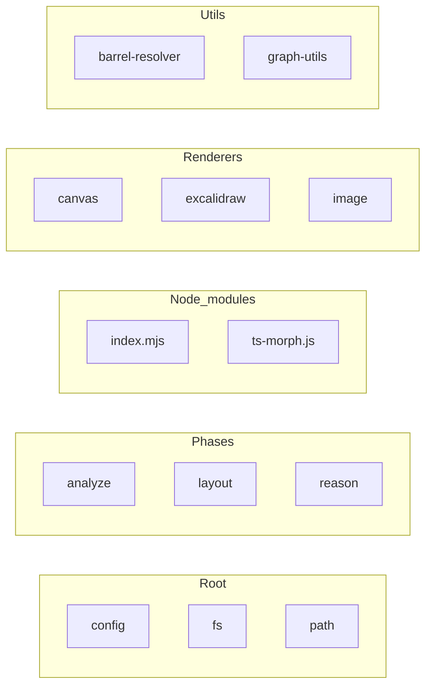

# Architecture: System Overview

```mermaid
graph LR
  subgraph root["Root"]
    config["config"]
    fs["fs"]
    path["path"]
  end
  subgraph phases["Phases"]
    phases_analyze["analyze"]
    phases_layout["layout"]
    phases_reason["reason"]
  end
  subgraph node_modules["Node_modules"]
    node_modules_dependency_cruiser_src_main_index_mjs["index.mjs"]
    node_modules_dependency_cruiser_src_main_index_mjs["index.mjs"]
    node_modules_ts_morph_dist_ts_morph_js["ts-morph.js"]
  end
  subgraph renderers["Renderers"]
    renderers_canvas["canvas"]
    renderers_excalidraw["excalidraw"]
    renderers_image["image"]
  end
  subgraph utils["Utils"]
    utils_barrel_resolver["barrel-resolver"]
    utils_graph_utils["graph-utils"]
  end
```
